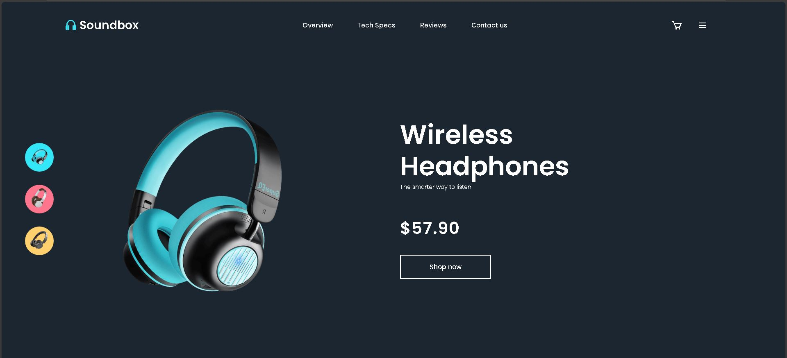

# 🛍️ E-commerce SoundBox

Projeto de uma página de e-commerce inspirado em produtos de áudio, criado para treinar construção de interfaces visuais com HTML, CSS e funcionalidades em JavaScript.

## 🖼️ Preview



## ✨ Tecnologias Utilizadas

- HTML
- CSS
- JavaScript

## 🎯 Objetivo

- Desenvolver uma vitrine virtual para um produto
- Trabalhar com design visual, organização de conteúdo e responsividade

## 🚀 Como Executar

1. Clone o repositório:
   ```bash
   git clone https://github.com/me-lucas-al/e-commerce-soundbox.git
